

# PV239 – 01 Introduction

---

## Introduction

<!--
header: '**Introduction** &nbsp;&nbsp; .NET MAUI &nbsp;&nbsp; Setup &nbsp;&nbsp; Layouts &nbsp;&nbsp; Controls'
-->

- Roman
- Ondřej
- And what about you?

---

## Exercises

- Introduction
- Design – XAML
- Architecture – MVVM
- Architecture – IoC/DI
- Storage
- Networking – API
- Topic of your choice

---

## Goals

- Course organization
- Get in touch with .NET MAUI
- Go through environment setup
- Get to know available layouts and controls

---

## Course Organization

- Interactive syllabi – IS
- Materials & Resources
    - [Materials repository](https://github.com/jasho/pv239-maui)
    - [Sample app repository](https://github.com/jasho/cookbook-maui)
- Stream/recordings – [Youtube](https://www.youtube.com/playlist?list=PLMD3_JXajX1iWN-KFRie7esaE9NP7eBlf)
- Optional homeworks
- Project

- [Discord](https://discord.gg/HWs8rmT4bh)

---

## Sample Application

- CookBook
- Android, iOS, Windows
- Communication with API
- Basic CRUD operations
- Saving of settings
- MVVM architecture
- Shell navigation

---

## "Standard" Application Development

<!--
header: 'Introduction &nbsp;&nbsp; **.NET MAUI** &nbsp;&nbsp; Setup &nbsp;&nbsp; Layouts &nbsp;&nbsp; Controls'
-->

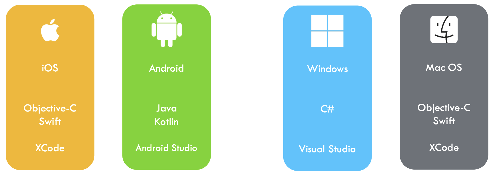

---

## .NET Multi-platform App UI

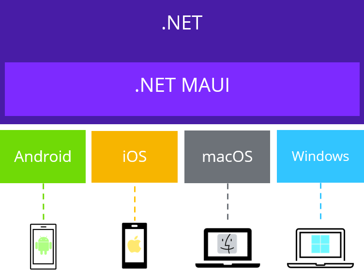

---

## How it Works - Structure

- Platform specific frameworks
    - .NET for Android
    - .NET for iOS
    - .NET for MacOS
- Windows UI (WinUI) library
- Common BCL - .NET
- .NET Runtimes
    - Mono – Android, iOS, MacOS
    - WinRT/Win32 – Windows

---

## How it Works - UI

- Platform specific UI
    - Different platforms - different ways of defining UI
    - Can be defined separately using platform specific APIs
    - .NET for Android, .NET for iOS, .NET for MacOs, WinUI
- Common UI
    - Single framework for defining UI – mobile & desktop
    - XAML

---

## How it Works - Android

- C# compiles to intermediate language (IL)
- IL + JIT in app

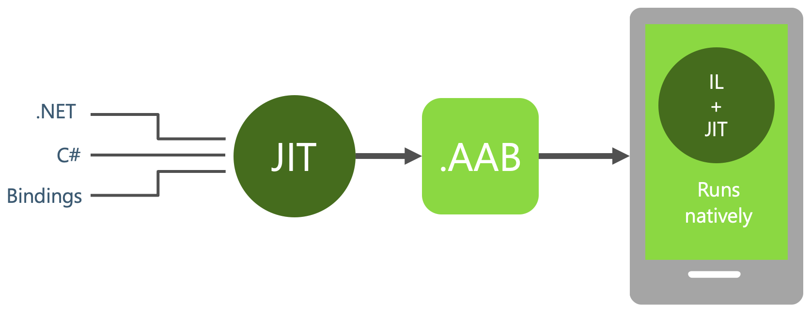

---

## How it Works - iOS

- Fully ahead-of-time (AOT) compiled to native ARM binary

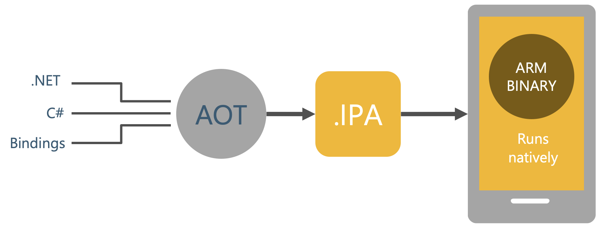

---

## How it Works - macOS & Windows

- MacOS
    - Using Mac Catalyst
    - Apple’s solution to bring iOS Apps to desktop
    - Provides access to Mac OS APIs
- Windows
    - WinUI 3 library
    - Native apps and UWP

---

## How .NET MAUI Works

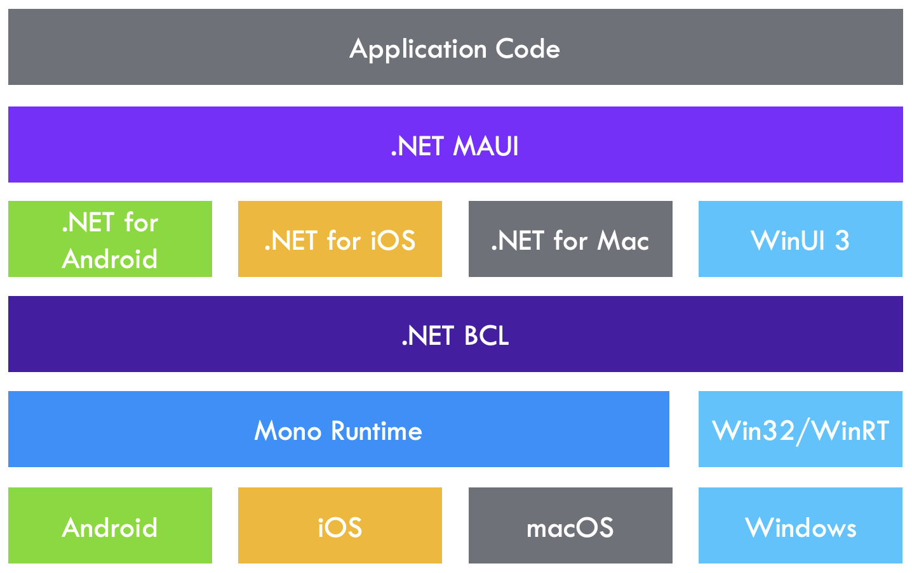

---

## .NET MAUI

- Collection of Controls
- Layout engine for pages
- Navigation – pages, drawers
- Customizable handlers – enable platform specific controls
- APIs for native device features – GPS, accelerometer…
- Graphics library for 2D drawing code
- Single project, multi-targeting system
- .NET hot reload

---

<!--
header: 'Introduction &nbsp;&nbsp; .NET MAUI &nbsp;&nbsp; **Setup** &nbsp;&nbsp; Layouts &nbsp;&nbsp; Controls'
-->

## Setup

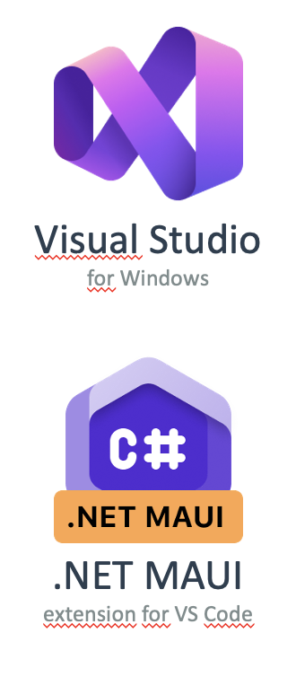

---

## Visual Studio Workloads

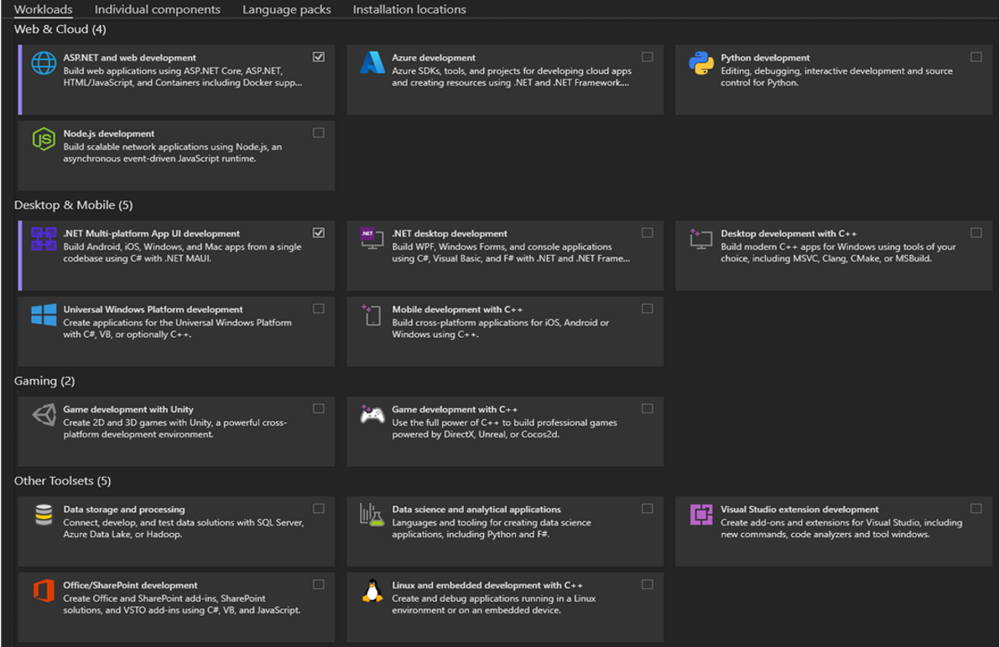

---

## iOS Development

- You need Mac Agent to compile the application
- Compilation runs on a Mac OS device
- Simulator and development can be done on Windows

---

## Create a New Project

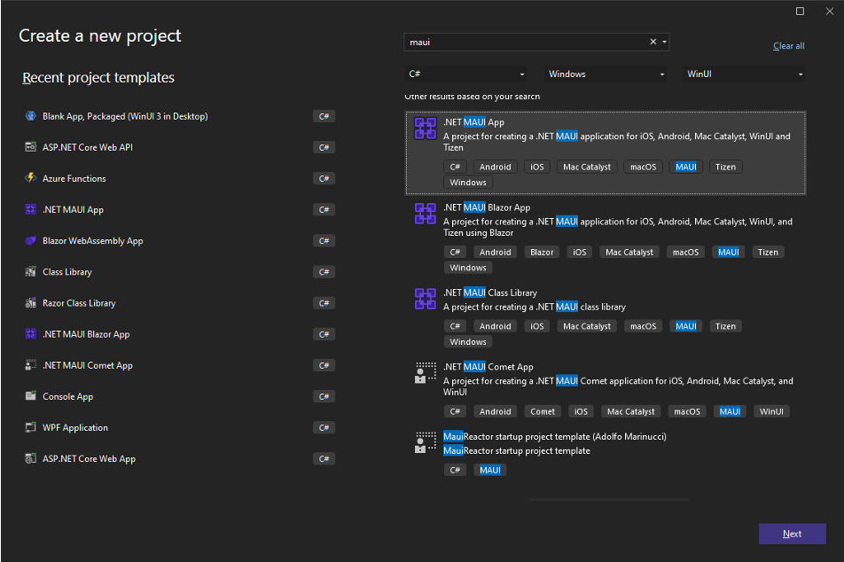

---

## Create a New Project

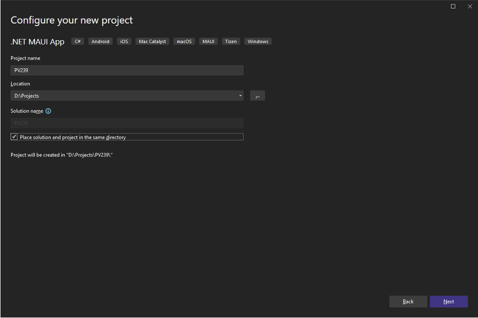

---

## Create a New Project

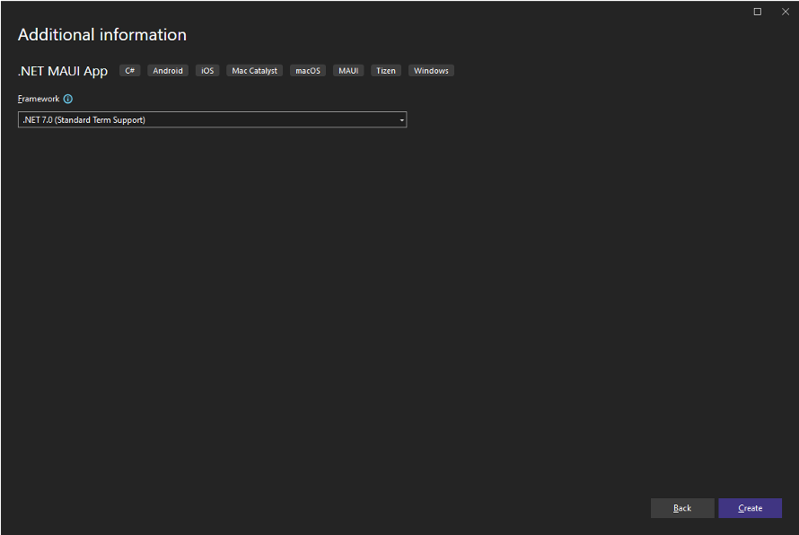

---

## Create a New Project
<!-- _class: demo -->

# DEMO

---

## Project Structure

- One project for all platforms
- Shared code & resources (fonts, images, icons, splash screens…)
- Platforms folder:
    - Android – system colors, manifest
    - iOS – launch screen, Info.plist
    - Windows – package manifest, app manifest
    - Mac OS – Info.plist
    - Each platform
        - Application startup point
        - Custom handlers for application specific controls

---

## Layouts
<!-- _class: layout-table -->

| **AbsoluteLayout** | **RelativeLayout** | **FlexLayout** |
|:------------------:|:------------------:|:--------------:|
|  | 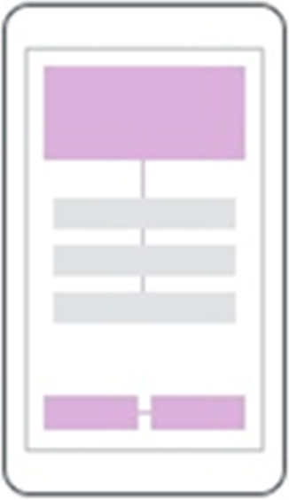 |  |

---

## Layouts
<!-- _class: layout-table -->

| **Grid** | **StackLayout** |
|:--------:|:---------------:|
|  | 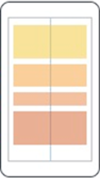 |

---

## Layouts - StackLayout
<!-- _class: layout-table-wrapped-header -->

| **StackLayout** | **VerticalStackLayout** | **Horizontal StackLayout** |
|:------------------:|:------------------:|:--------------:|
|  |  | 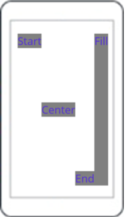 |

---

## Grid

- Table-style layout
- RowDefinitions, ColumnDefinitions
    - Width / Height = 150 | * | Auto
- Grid.Row, Grid.Column – placement of control in the Grid
- Grid.RowSpan, Grid.ColumnSpan – control can span over multiple “cells”
- HorizontalSpacing, VerticalSpacing – empty space between “cells”

---

## StackLayout...

- HorizontalStackLayout, VerticalStackLayout
    - Individual layouts for single direction
    - Separate LayoutManagers with Measure methods
    - Recommended
- StackLayout
    - Wraps HorizontalStackLayout and VerticalStackLayout
    - Has Orientation
    - Useful for adaptive layouts

---

## Layouts
<!-- _class: demo -->

# DEMO

---

<!--
header: 'Introduction &nbsp;&nbsp; .NET MAUI &nbsp;&nbsp; Setup &nbsp;&nbsp; Layouts &nbsp;&nbsp; **Controls**'
-->

## Controls

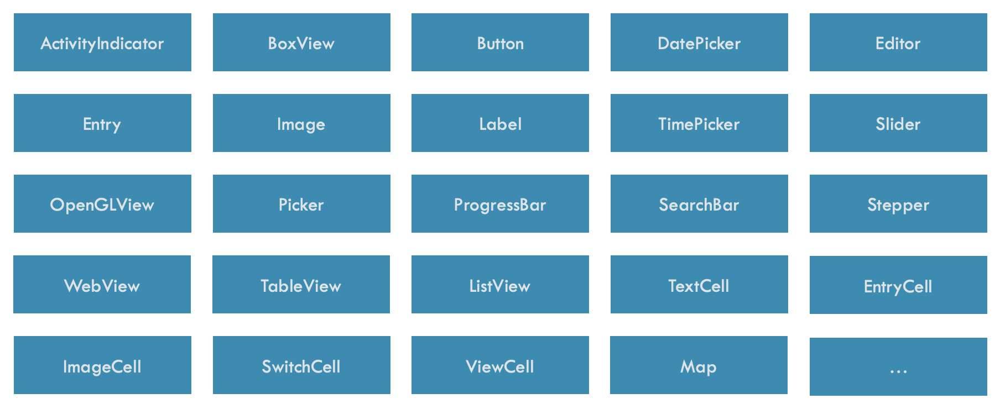

---

## Content Presentation
<!-- _class: content-grid -->

| | | |
|:--:|:--:|:--:|
| 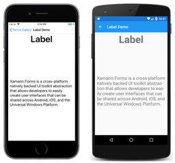 | 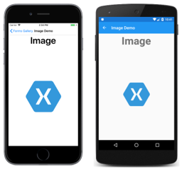 | 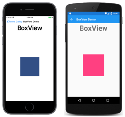 |
| 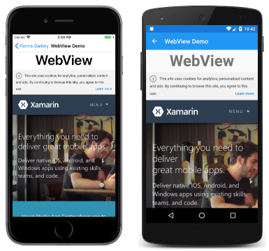 | 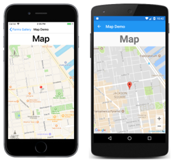 |

---

## Actionable Controls

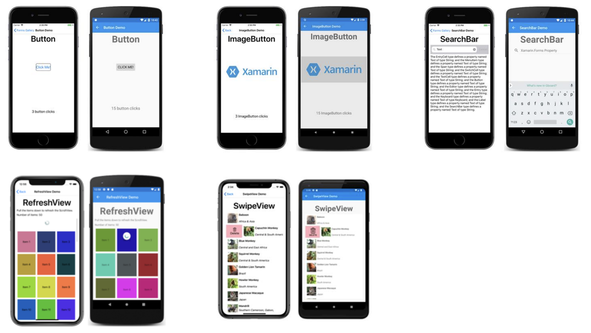

---

## Setting Values

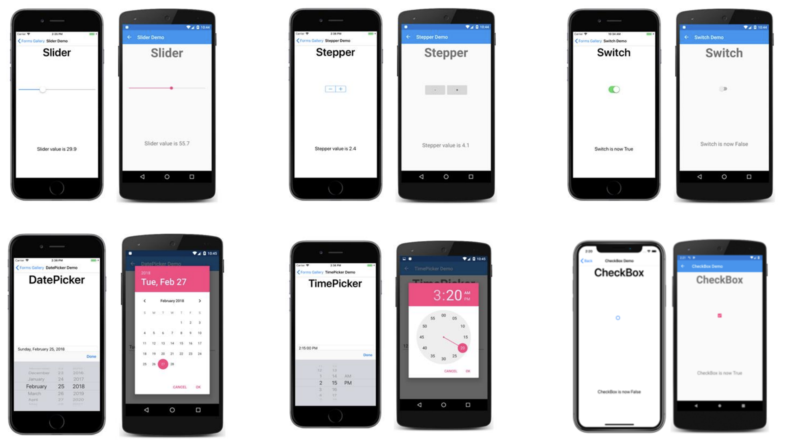

---

## Editing Text

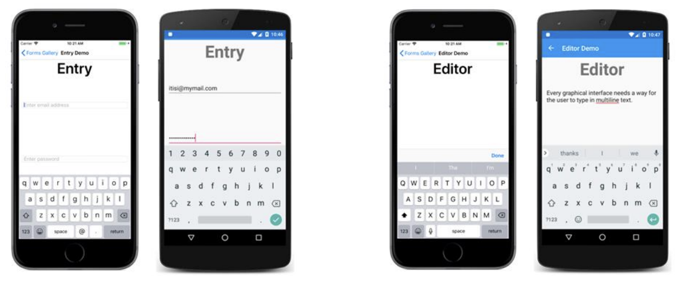

---

## Activity Indication

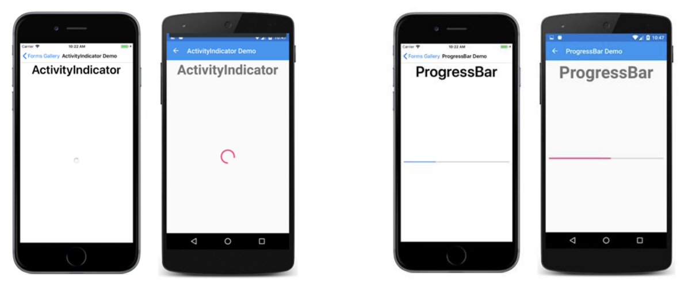

---

## Collections

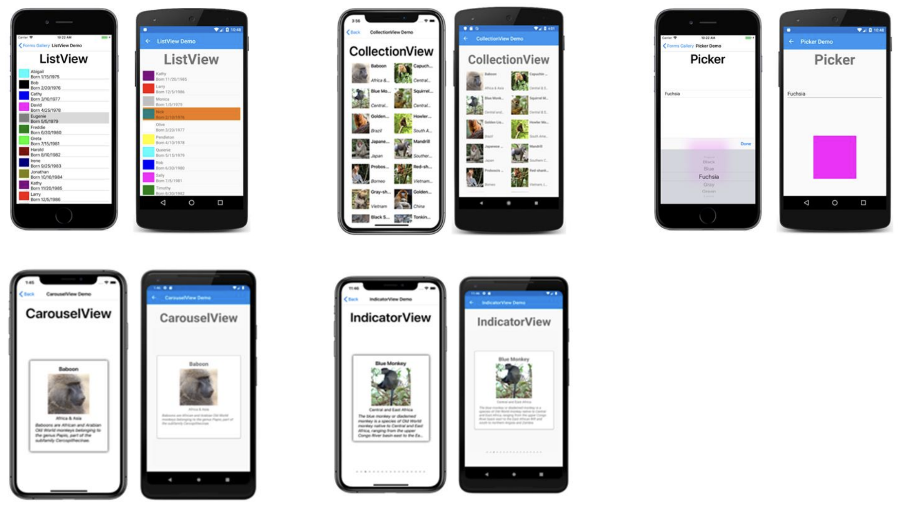

---

## Pop-ups

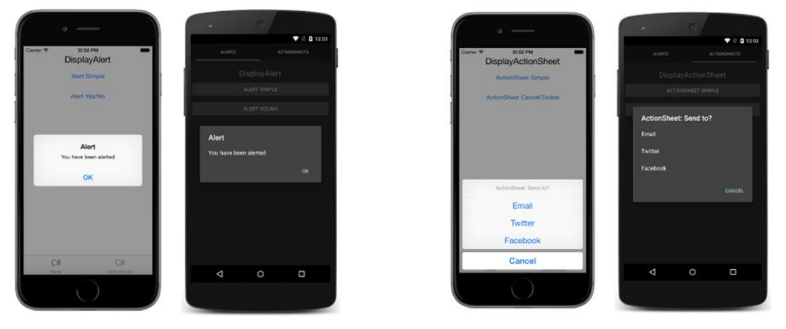

---

## Commercial components

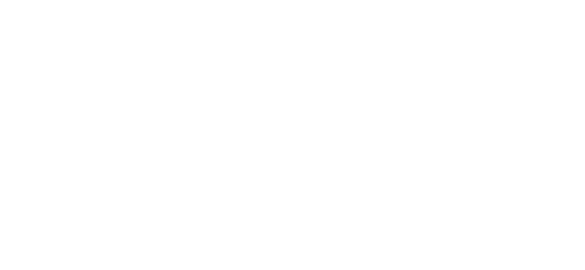

---

## Bonus - Pages

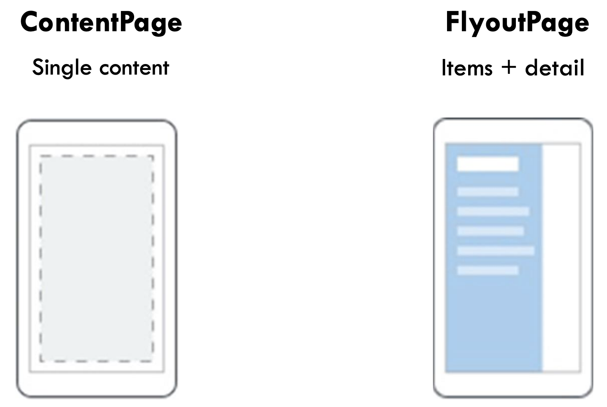

---

## Bonus - Pages

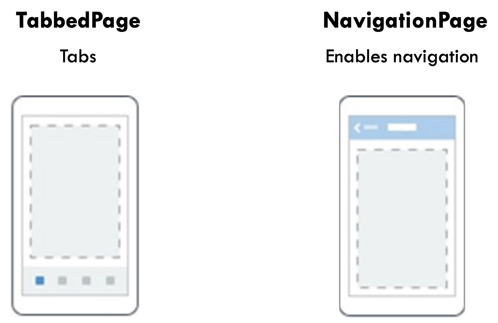

---

## Bonus - Pages

- First displayed page is in App.xaml.cs
    - Default - MainPage

---

## Today's Goals

- People introduction
- Get in touch with .NET MAUI
- Go through environment setup
- Get to know available layouts and controls
