

# PV239 – 02 Design

---

## Goals

- Get to know available layouts
- Create a layout with some controls
- Get to know available navigation options
- Styles
- Localization

---

## Controls
<!--
header: '**Layouts** &nbsp;&nbsp; Navigation &nbsp;&nbsp; Styles &nbsp;&nbsp; Localization'
-->

<!-- _class: controls-grid -->

| | | | | |
|:--:|:--:|:--:|:--:|:--:|
| ActivityIndicator | BoxView | Button | DatePicker | Editor |
| Entry | Image | Label | TimePicker | Slider |
| OpenGLView | Picker | ProgressBar | SearchBar | Stepper |
| WebView | TableView | ListView | TextCell | EntryCell |
| ImageCell | SwitchCell | ViewCell | Map | ... |

---

## Layouts
<!-- _class: layout-table -->

| **Grid** | **StackLayout** |
|:--------:|:---------------:|
| 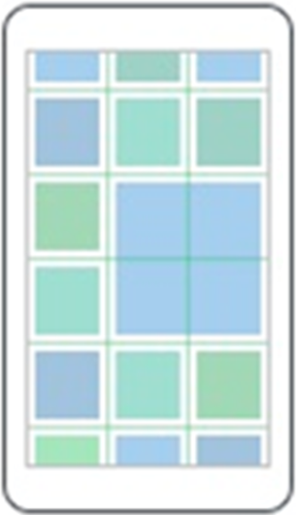 | 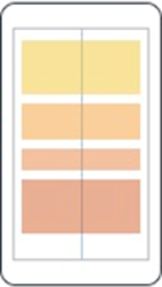 |

---

## Grid

- Table-style layout
- RowDefinitions, ColumnDefinitions
    - Width / Height = 150 | * | Auto
- Grid.Row, Grid.Column – placement of control in the Grid
- Grid.RowSpan, Grid.ColumnSpan – control can span over multiple “cells”
- HorizontalSpacing, VerticalSpacing – empty space between “cells”

---

## Layouts - StackLayout
<!-- _class: layout-table -->

| **VerticalStackLayout** | **HorizontalStackLayout** |
|:------------------:|:--------------:|
| 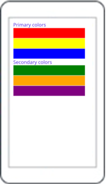 | 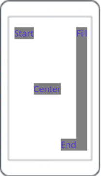 |

---

## StackLayout...

- HorizontalStackLayout, VerticalStackLayout
    - Individual layouts for single direction
    - Separate LayoutManagers with Measure methods
    - Recommended
- StackLayout
    - Wraps HorizontalStackLayout and VerticalStackLayout
    - Has Orientation
    - Useful for adaptive layouts

---

## Layouts
<!-- _class: layout-table -->

| **AbsoluteLayout** | **FlexLayout** |
|:------------------:|:--------------:|
| 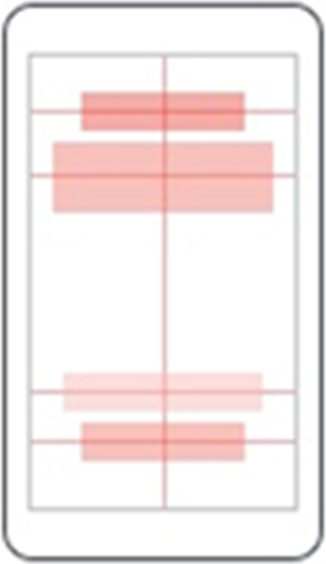 | 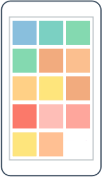 |

---

## Layouts demo
<!-- _class: demo -->

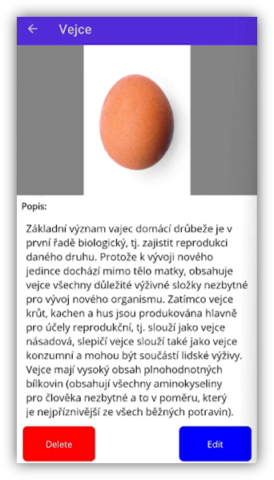

---

## Shell

<!--
header: 'Layouts &nbsp;&nbsp; **Navigation** &nbsp;&nbsp; Styles &nbsp;&nbsp; Localization'
-->

- Application layout
- Navigation using URIs
- Hierarchical navigation
- Easy passing of parameters between pages
    - String parameters or strongly typed objects
    - Works even in backwards navigation “..?success=true”

---

## Shell - Flyout
<!-- _class: two-column -->

| | |
|--|--|
| <ul><li>Header</li><li>Items</li><li>Footer</li></ul><ul><li>Support for text, icons or custom templates</li></ul> | 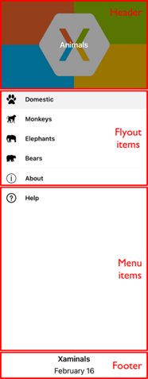 |

---

## Shell - tabs
<!-- _class: two-column -->

| | |
|--|--|
| <ul><li>2 levels of hierachy<ul><li>Bottom tabs</li><li>Top tabs</li></ul></li></ul><ul><li>Support for text, icons, custom templates</li></ul> | 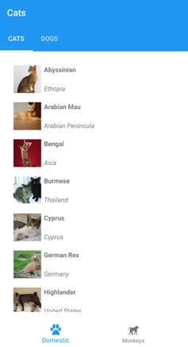 |

---

## Shell - MenuBar
<!-- _class: two-column -->

| | |
|--|--|
| <ul><li>MenuBarItem</li><li>MenuFlyoutItem</li><li>MenuFlyoutSubItem</li> <li>Support for text, icons</li></ul> | 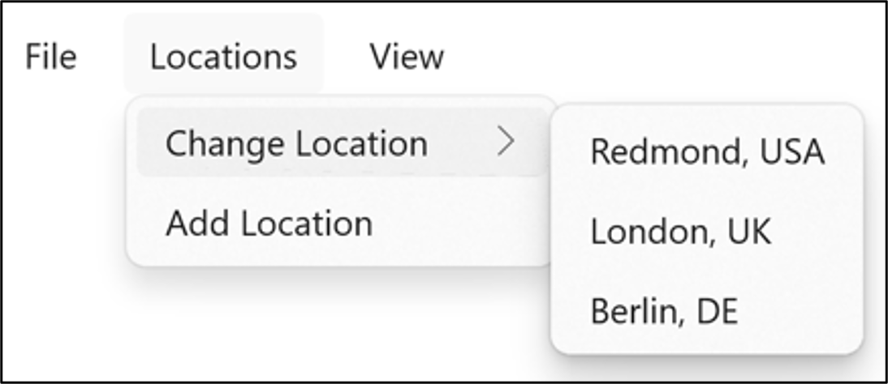 |

---

## NavigationPage

- NavigationPage
- PushAsync
- PopAsync

---

## Pages
<!-- _class: layout-table -->

| **ContentPage** | **TabbedPage** | **FlyoutPage** |
|:------------------:|:--------------:|:--------------:|
| 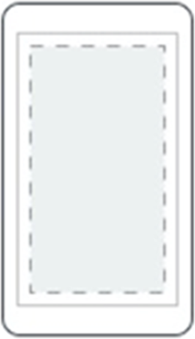 | 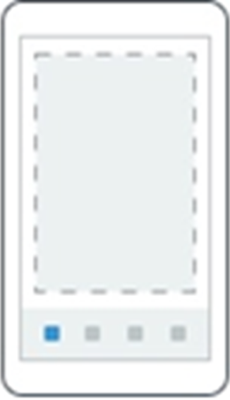 | 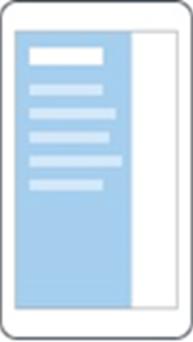 |

---

## Navigation
<!-- _class: demo -->

# DEMO

---

## Resources
<!--
header: 'Layouts &nbsp;&nbsp; Navigation &nbsp;&nbsp; **Styles** &nbsp;&nbsp; Localization'
-->

- Each element contains a collection of **Resources**
- Resources can define any content
- Referencing using **x:Key**
- Access with **{StaticResource Key}**
- Can be defined in separate files - **merged dictionaries**
- Hierarchical application
    - Can be overridden on any level

---

## Styles
- Setting style for a control
- **TargetType** – specifies which element type it should be applied to
- **x:Key** – key of style, can be omitted – in that case it will be automatically applied to all controls of the type
- Collection of **Setter** objects
    - **Property**
    - **Value**
- **BasedOn** – base style that this style extends – optional

---

## Styles
<!-- _class: demo -->

# DEMO

---

## Localization
<!--
header: 'Layouts &nbsp;&nbsp; Navigation &nbsp;&nbsp; Styles &nbsp;&nbsp; **Localization**'
-->

- .resx files
- Separate files for separate views
- Don’t use resources in multiple places

---

## Localization
<!-- _class: demo -->

# DEMO

---

## Goals

- Get to know available layouts
- Create a layout with some controls
- Get to know available navigation options
- Styles
- Localization