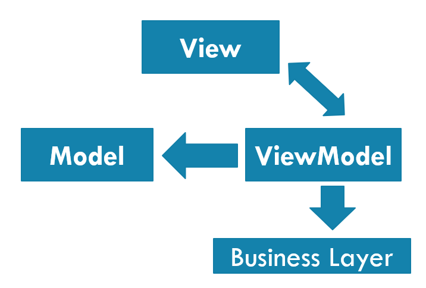

# PV239 – 03 MVVM

---

## What do you already know?
- MVVM
- Data Binding
- Command
- Inversion of Control/Dependency Injection

---

## Goals
- Get to know the MVVM design pattern
- Look at the concepts for Data Binding

---

## Model View ViewModel
<!--
header: '**MVVM** &nbsp;&nbsp; Binding &nbsp;&nbsp; INotify\* &nbsp;&nbsp; CommunityToolkit.Mvvm &nbsp;&nbsp; Command'
-->

<!-- _class: two-column -->

| | |
|--|--|
| <ul><li>**Model** – Represents data</li><li>**View** – Displays data to user and provides interactivity options.</li><li>**ViewModel** – keeps the current context of the View</li></ul> |  |

---

## Binding
<!--
header: 'MVVM &nbsp;&nbsp; **Binding** &nbsp;&nbsp; INotify\* &nbsp;&nbsp; CommunityToolkit.Mvvm &nbsp;&nbsp; Command'
-->

Binding the value from the backend to its display in the frontend

---

## Binding types - current **BindingContext**

- **{Binding}**
    - Referencing current BindingContext
- **{Binding Name}**
    - Referencing property Name in current BindingContext
- **{Binding Name.Length}**
    - Referencing property **Name.Length**

---

## Binding types - **named element**

- attribute **x:Name**
- **{Binding Path=Text, Source={x:Reference TextBox1}}**
    - Referencing property Text of object TextBox1
- **x:DataType**
- Specifies data type of the object that is used in current BindingContext
- If it is unclear what data type is used in current BindingContext
- Used for compiled bindings - build-time control, performance optimization, Intellisense

---

## Binding directions

- Attribute **Mode**

- **OneTime**
    - Value is set only one time when the control is created
- **OneWay**
    - Value updates in one way – from backend to frontend (for example Label)
- **TwoWay**
    - Value updates in both ways (for example Entry)
- **OneWayToSource**
    - Value updates in one way – from frontend to backend

---

## MVVM, Binding
<!-- _class: demo -->

# DEMO

---

## Binding – notify about changes
<!--
header: 'MVVM &nbsp;&nbsp; Binding &nbsp;&nbsp; **INotify\*** &nbsp;&nbsp; CommunityToolkit.Mvvm &nbsp;&nbsp; Command'
-->

- **OneWay & TwoWay**
- Reacts on value changes in the backend
- The frontend needs to be notified that something changed
- Backend object implements **INotifyPropertyChanged**
- public event PropertyChangedEventHandler PropertyChanged

- It’s advised to add an OnPropertyChanged method with a parameter with attribute [CallerMemberName]

---

## INotifyCollectionChanged
- If something changes inside an existing collection (item gets added or removed)
- **ObservableCollection<T>**
    - Already implements interface INotifyCollectionChanged
- Existing collections
    - Create a wrapper that implements INotifyCollectionChanged
- Custom collections
    - Implement INotifyCollectionChanged and add support for notitfying the frontend on changes

---

## INotifyPropertyChanged, INotifyCollectionChanged
<!-- _class: demo -->

# DEMO

---

## CommunityToolkit.Mvvm
<!--
header: 'MVVM &nbsp;&nbsp; Binding &nbsp;&nbsp; INotify\* &nbsp;&nbsp; **CommunityToolkit.Mvvm** &nbsp;&nbsp; Command'
-->

- Framework independent – can be used with .NET MAUI, WPF, WinForms, Xamarin...
- Uses source generators
- Helps with
    - Property changed events
    - Commands
    - Messaging

---

## CommunityToolkit.Mvvm - observableobject

- Base class that implements **INotifyPropertyChanged** & **INotifyPropertyChanging**
- Provides SetProperty() method that handles setting value and notifying

- Alternatively can be added by using **\[INotifyPropertyChanged\]** attribute
- If the class already inherits from a base class and cannot inherit from ObservableObject

---

## CommunityToolkit.Mvvm - ObservableProperty

- Attribute **\[ObservableProperty\]**
- Add to a field and get the corresponding property generated
- Can be used in classes that implement **INotifyPropertyChanged**

---

## CommunityToolkit.Mvvm
<!-- _class: demo -->

# DEMO

---

## ICommand
<!--
header: 'MVVM &nbsp;&nbsp; Binding &nbsp;&nbsp; INotify\* &nbsp;&nbsp; CommunityToolkit.Mvvm &nbsp;&nbsp; **Command**'
-->

- Interface for making actions while using Bindings

- public void Execute(object parameter)
- public bool CanExecute(object parameter)
- public event EventHandler CanExecuteChanged

- Usage in XAML
    - Command="{Binding SaveCommand}"

---

## Command Parameter

- Passing value to Command
- Value gets passed as type Object – needs to be casted
- CommandParameter="{Binding Detail}"

---

## Command
<!-- _class: demo -->

# DEMO

---

## CommunityToolkit.Mvvm - RelayCommand

- Implementation of ICommand interface
- Add attribute to a method and get the command property generated
- Supports CanExecuteChanged and passing of values
- Also for asynchronous methods with CancellationToken support

- \[RelayCommand\], \[RelayCommand<T>\]
- \[AsyncRelayCommand\], \[AsyncRelayCommand<T>\]

---

## CommunityToolkit.Mvvm - RelayCommand
<!-- _class: demo -->

# DEMO

---

## Goals

- Get to know the MVVM design pattern
- Look at the concepts for Data Binding
