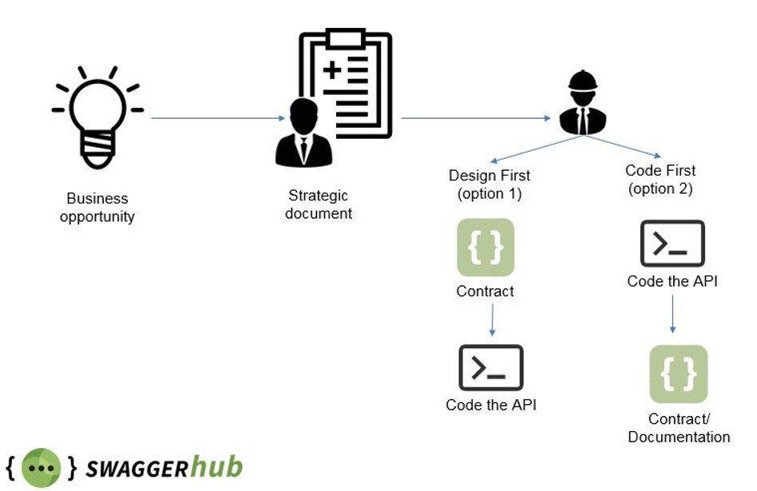

<style>
    @import url('../styles/presentation-styles.css');

    .container {
        display: flex;
    }

    .col {
        flex: 1
    }

    img[alt~="center"] {
    display: block;
    margin: 0 auto;
    }

    section.demo h1 {
        text-align: center;
        margin: 180px;
        font-size: 80px;
        color: rgb(132, 168, 196)
}
</style>

# PV239 – 06 API

---

## Goals
- Web API concepts
- Client-server communication
- Generating API client and its usage to communicate with API

---

## OpenAPI
<!--
header: '**OpenAPI** &nbsp;&nbsp; Generating client &nbsp;&nbsp; Using client'
-->

- Open specification
- Standard for describing REST API
- Language and framework independent
- YAML/JSON
- OpenAPI map: https://openapi-map.apihandyman.io/

---

## Swagger
- Tools for creating and working with OpenAPI specification
- Swagger Editor
    - YAML/JSON
- Swagger CodeGen
    - Generating client/server part

- Swagger UI
    - Interactive documentation

---

## Approaches for creating API specification



---

## Design-first approach

- SwaggerHub
    - https://app.swaggerhub.com/
- Portal for design first approach
- Supports hosting on own server

---

## Code-first approach

- ASP .NET Core
- Library NSwag.AspNetCore

---

## OPEN API Code-first
<!-- _class: demo -->

# DEMO

---

## Setup

- Nuget package NSwag.AspNetCore
- Add configuration:

```csharp
services.AddOpenApiDocument(document =>
{
    document.Title = "CookBook API";
    document.DocumentName = "cookbook-api";
});
```

---

## Setup

- Add middleware:
```csharp
app.UseOpenApi();
```

- Add middleware for Swagger UI:
```csharp
app.UseSwaggerUi3(settings =>
{
  settings.SwaggerRoutes.Add(
    new SwaggerUi3Route("CookBook API", "/swagger/cookbook-api/swagger.json"));
});
```

---

## Swagger editor
- Online version https://editor.swagger.io
- Support for running locally
    - Docker image

---

## Generating - NSwagStudio
<!--
header: 'OpenAPI &nbsp;&nbsp; **Generating client** &nbsp;&nbsp; Using client'
-->

- NSwag - CLI tool
- NSwagStudio - Desktop app
- https://github.com/RSuter/NSwag
- Settings:
    - Namespace
    - Set Operation Generation Mode
    - Path to output file

---

## NSwagStudio
<!-- _class: demo -->

# DEMO

---

## Adding client to mobile app
<!--
header: 'OpenAPI &nbsp;&nbsp; Generating client &nbsp;&nbsp; **Using client**'
-->
- Add client registration to DI container:
```csharp
serviceCollection.AddHttpClient<IIngredientsClient, IngredientsClient>(client =>
{
   client.BaseAddress = apiBaseUri;
});
 For usage in emulators
URL for „Localhost“: 10.0.2.2
```

---

## Using generated client

<!-- _class: demo -->

# DEMO

---

## Processors
- Used for modifying the OpenAPI specification
- Can be used on multiple levels:
    - `IOperationProcessor` – modifies individual operations
    - `ISchemaProcessor` – modifies the schema
    - `IDocumentProcessor` – modifies the entire document

---

## Goals
- Web API concepts
- Client-server communication
- Generating API client and its usage to communicate with API