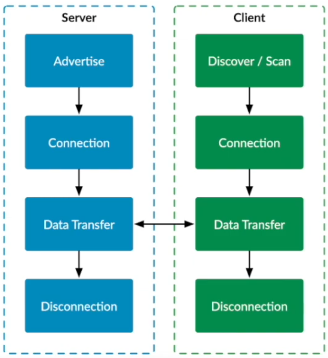

# PV239 – Bonus 1 - Working with Bluetooth

---

## Goals
- Introduction to Bluetooth
- Simple Bluetooth communication demo in .NET MAUI using Plugin.BLE library
- Quick look at implementing resilient Bluetooth request-response communication

---

## Introduction to Bluetooth
<!--
header: '**Introduction to Bluetooth** &nbsp;&nbsp; Bluetooth in .NET MAUI &nbsp;&nbsp; Demo'
-->

- Wireless communication technology for short-range communication
- Operates in the 2.4 GHz ISM band with ranges up to 100 meters
- Commonly used for connecting peripherals (headphones, keyboards, etc.) and IoT devices

---

## Client-server communication
<!--
header: '**Introduction to Bluetooth** &nbsp;&nbsp; Bluetooth in .NET MAUI &nbsp;&nbsp; Demo'
-->

- Bluetooth uses the client/server model
- Server advertises services and characteristics
- Client is in control of initiating communication and requesting data from the server
- Server responds back to client requests

---

## Bluetooth Connection Steps
<!--
header: '**Introduction to Bluetooth** &nbsp;&nbsp; Bluetooth in .NET MAUI &nbsp;&nbsp; Demo'
-->

1. **Advertising and scanning**: Server advertises, client scans
2. **Connecting**: Client initiates connection
3. **Discovering services**: Client discovers services and characteristics
4. **Reading/writing**: Client reads/writes characteristic data
5. **Subscribing to notifications**: Client subscribes to characteristic changes
6. **Disconnecting**: Either side disconnects when done

---

## Working with Bluetooth in .NET MAUI
<!--
header: 'Introduction to Bluetooth &nbsp;&nbsp; **Bluetooth in .NET MAUI** &nbsp;&nbsp; Demo'
-->

- Library [Plugin.BLE[(https://github.com/dotnet-bluetooth-le/dotnet-bluetooth-le)]
- Cross-platform support for Bluetooth LE communication
- Provides API for scanning, connecting, discovering services/characteristics, reading/writing data, and subscribing to notifications

---

## Demo: Simple Bluetooth communication in .NET MAUI
<!--
header: 'Introduction to Bluetooth &nbsp;&nbsp; Bluetooth in .NET MAUI &nbsp;&nbsp; **Demo**'
-->

---

## Demo: Resilient Bluetooth communication
<!--
header: 'Introduction to Bluetooth &nbsp;&nbsp; Bluetooth in .NET MAUI &nbsp;&nbsp; **Demo**'
-->